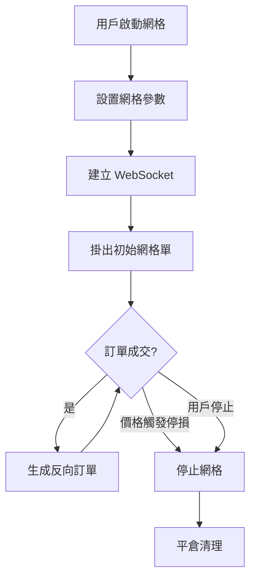

# orderly-bot 專案交接文檔

> 企業級網格交易系統 (Enterprise-grade Grid Trading System)

---

## 目錄

1. [專案概述](#專案概述)
2. [30 分鐘上手清單](#30-分鐘上手清單)
3. [技術架構](#技術架構)
4. [目錄結構](#目錄結構)
5. [核心模組說明](#核心模組說明)
6. [API 端點](#api-端點)
7. [資料庫結構](#資料庫結構)
8. [網格策略](#網格策略)
9. [環境配置](#環境配置)
10. [部署指南](#部署指南)
11. [日常維護](#日常維護)
12. [開發指南](#開發指南)
13. [已知問題與注意事項](#已知問題與注意事項)
14. [變更紀錄](#變更紀錄)

---

## 專案概述

### 功能簡介

orderly-bot 是為 Orderly Network 設計的企業級網格交易系統，提供：

| 功能 | 說明 |
|------|------|
| 多策略網格 | 支持等差網格和等比網格 |
| 多方向交易 | 做多 (LONG)、做空 (SHORT)、雙向 (BOTH) |
| 多會話管理 | 同時運行多個獨立交易會話 |
| 實時 WebSocket | 訂單成交即時回報 |
| 斷路器保護 | WebSocket 自動重連與熔斷機制 |
| 利潤追蹤 | 即時利潤計算與報告 |

### 交易流程



---

## 30 分鐘上手清單

### 0-10 分鐘：環境與依賴

```bash
cd orderly-bot
python -m venv .venv
source .venv/bin/activate
pip install -r requirements.txt
cp .env.example .env
```

`.env` 至少確認：
- `ORDERLY_KEY`、`ORDERLY_SECRET`、`ORDERLY_ACCOUNT_ID`
- `MONGODB_URI`

### 10-20 分鐘：啟動與健康檢查

```bash
python app.py
# 或
uvicorn src.api.server:app --host 0.0.0.0 --port 8001 --reload
```

```bash
curl http://localhost:8001/health
curl http://localhost:8001/metrics
```

### 20-30 分鐘：關鍵測試與入口

```bash
pytest -q tests/unit/test_mongo_manager.py
pytest -q tests/unit/test_grid_signal.py
```

優先閱讀：
1. `src/api/server.py` — 入口與路由
2. `src/core/grid_bot.py` — 交易主流程
3. `src/services/session_service.py` — 會話管理

### 常見故障速查

| 症狀 | 排查方向 |
|------|----------|
| `object Mock can't be used in 'await' expression` | 測試中 `Mock` 改 `AsyncMock`（DB async methods） |
| 啟動失敗、環境變數缺失 | 檢查 `.env` 必填欄位 |
| 測試不穩定或依賴外部狀態 | 先跑單檔測試定位，再跑全量測試 |

---

## 技術架構

### 技術棧

| 類別 | 技術 |
|------|------|
| Web 框架 | FastAPI |
| 資料庫 | MongoDB (Motor async driver) |
| WebSocket | orderly-evm-connector |
| 認證 | 錢包簽名 (eth-account, nacl)，共享 `shared/wallet_verifier/` |
| 限流 | SlowAPI |
| 監控 | psutil (系統監控) |
| 容器化 | Docker (multi-stage build) |

### 架構圖

```
┌─────────────────────────────────────────────────────────────┐
│                      FastAPI Server                          │
│                     (src/api/server.py)                      │
├───────────────┬───────────────┬─────────────────────────────┤
│   Middleware  │    Routes     │      Authentication         │
│  - CORS       │  - /api/grid  │  - Wallet Signature         │
│  - Rate Limit │  - /health    │  - EVM / Solana             │
│               │  - /metrics   │                             │
├───────────────┴───────────────┴─────────────────────────────┤
│                    Session Manager                           │
│              (src/services/session_service.py)               │
├──────────────────────────────────────────────────────────────┤
│                      Core Trading                            │
│  GridTradingBot │ GridSignalGenerator │ OrderlyClient        │
│  (grid_bot.py)  │   (grid_signal.py)  │    (client.py)       │
├──────────────────────────────────────────────────────────────┤
│                   WebSocket / Database                       │
│  WebSocketManager │ MongoDB │ ProfitTracker                  │
└──────────────────────────────────────────────────────────────┘
```

---

## 目錄結構

```
orderly-bot/
├── app.py                              # 主入口
├── Dockerfile                          # Docker 配置
├── requirements.txt                    # Python 依賴
├── src/
│   ├── api/
│   │   └── server.py                   # FastAPI 應用 (1400+ 行)
│   ├── core/
│   │   ├── grid_bot.py                 # 交易機器人 (3500+ 行)
│   │   ├── grid_signal.py              # 訊號生成器
│   │   ├── client.py                   # Orderly API 客戶端
│   │   └── profit_tracker.py           # 利潤追蹤
│   ├── services/
│   │   ├── session_service.py          # 會話管理 (1000+ 行)
│   │   ├── database_service.py         # 資料庫操作
│   │   ├── grid_summary_service.py     # 網格摘要
│   │   └── database_connection.py      # MongoDB 連接管理
│   ├── auth/
│   │   ├── wallet_signature.py         # 錢包簽名驗證（繼承 shared/wallet_verifier）
│   │   └── auth_decorators.py          # 認證裝飾器
│   ├── models/
│   │   └── grid_summary.py             # 網格摘要模型
│   └── utils/
│       ├── cors_config.py              # CORS 配置（從環境變數讀取）
│       ├── session_manager.py          # 會話狀態管理
│       ├── event_queue.py              # 有序事件處理
│       ├── market_validator.py         # 價格/數量驗證
│       ├── retry_handler.py            # 彈性 API 調用
│       ├── order_tracker.py            # 訂單追蹤
│       ├── logging_config.py           # 結構化日誌
│       ├── error_codes.py              # 錯誤代碼
│       ├── websocket_manager.py        # WebSocket 管理
│       ├── system_monitor.py           # 系統健康監控
│       └── mongodb_health.py           # 資料庫健康檢查
└── tests/                              # 測試套件
    ├── unit/
    ├── integration/
    └── conftest.py
```

---

## 核心模組說明

### 1. 網格交易機器人 (`grid_bot.py`)

核心類別 `GridTradingBot`，負責訂單生命週期管理、WebSocket 事件處理、反向訂單生成、利潤追蹤。

| 機制 | 說明 |
|------|------|
| 斷路器 (Circuit Breaker) | WebSocket 連續失敗時熔斷，防止野蠻重連 |
| 重複訂單檢查 | 防止同價位重複下單 |
| 並發控制 | `asyncio.Lock` 保護共享狀態 |
| 事件去重 | 避免 WebSocket 重複事件 |

**WebSocket 重連策略：** 指數退避，base 3s，max 120s，max retries 8。

### 2. 訊號生成器 (`grid_signal.py`)

#### 等差網格 (ARITHMETIC)
```
價格間距 = (上界 - 下界) / (網格數 - 1)
```

#### 等比網格 (GEOMETRIC)
```
下方: price = current_price × (1 - grid_ratio)^i
上方: price = current_price × (1 + grid_ratio)^i
```

| 方向 | 初始倉位 | 網格分佈 |
|------|----------|----------|
| LONG | 50% 資金開多倉 | 下方網格 (加倉) |
| SHORT | 50% 資金開空倉 | 上方網格 (加倉) |
| BOTH | 無初始倉位 | 上下同時掛單 |

### 3. Orderly 客戶端 (`client.py`)

| 方法 | 說明 |
|------|------|
| `create_limit_order()` | 創建限價訂單 |
| `create_market_order()` | 創建市價訂單 |
| `cancel_order()` / `cancel_all_orders()` | 取消訂單 |
| `get_positions()` / `get_orders()` | 查詢持倉/訂單 |
| `close_position()` | 平倉 |

速率控制使用 `_rate_control` 字典實現自適應速率限制（自動退避 + 恢復）。`rate_limiter` 物件用於 `execute_with_protection` 包裝。

### 4. 會話管理器 (`session_service.py`)

- 多會話並發管理（同 ticker-account 僅允許一個活躍會話）
- 會話恢復與持久化
- `SessionCreationLimiter`: max_concurrent=5, max_per_second=10
- `get_bot(session_id)`: 取得 bot 實例（帶鎖保護與 session 存在性檢查）

---

## API 端點

### 網格交易

| 端點 | 方法 | 說明 |
|------|------|------|
| `/api/grid/start` | POST | 啟動網格交易 |
| `/api/grid/stop` | POST | 停止網格交易 |
| `/api/grid/status/{session_id}` | GET | 獲取會話狀態 |
| `/api/grid/sessions` | GET | 列出所有會話 |
| `/api/grid/user/{user_id}/grids` | GET | 獲取用戶所有網格 |
| `/api/grid/profit/{session_id}` | GET | 獲取利潤報告 |
| `/api/grid/summary` | GET | 網格摘要 (支持篩選) |
| `/api/grid/stream/{user_id}` | GET | SSE 實時推送 |
| `/api/grid/teststop` | POST | 測試用停止（僅 `DEBUG=true`） |

### 啟動網格請求範例

```json
{
  "ticker": "PERP_BTC_USDC",
  "direction": "BOTH",
  "current_price": 42500,
  "upper_bound": 45000,
  "lower_bound": 40000,
  "grid_levels": 6,
  "total_margin": 1000,
  "grid_type": "ARITHMETIC",
  "user_id": "user123",
  "user_sig": "wallet_signature",
  "timestamp": 1234567890,
  "nonce": "random_nonce"
}
```

### 系統監控

| 端點 | 說明 |
|------|------|
| `/health` | 健康檢查 |
| `/health/ready` | 就緒檢查 (含 MongoDB、WebSocket) |
| `/metrics` | 詳細系統指標 |

---

## 資料庫結構

### Collections

#### `sessions`
```javascript
{
  _id: "user123_PERP_BTC_USDC",
  user_id: "user123",
  ticker: "PERP_BTC_USDC",
  status: "ACTIVE",  // ACTIVE, STOPPED, ERROR
  config: {
    direction: "BOTH",
    grid_type: "ARITHMETIC",
    upper_bound: 45000,
    lower_bound: 40000,
    grid_levels: 6,
    total_margin: 1000
  },
  created_at: ISODate("2024-01-01T12:00:00Z"),
  updated_at: ISODate("2024-01-01T12:30:00Z")
}
```

#### `grid_summaries`
```javascript
{
  _id: ObjectId("..."),
  session_id: "user123_PERP_BTC_USDC",
  user_id: "user123",
  ticker: "PERP_BTC_USDC",
  total_orders: 25,
  successful_orders: 23,
  total_profit: 150.50,
  stop_reason: "MANUAL",
  created_at: ISODate("2024-01-01T12:00:00Z")
}
```

#### `user_api_keys`
```javascript
{
  _id: "user123",
  user_api_key: "encrypted_key",
  user_api_secret: "encrypted_secret",
  created_at: ISODate("2024-01-01T12:00:00Z")
}
```

---

## 網格策略

### 參數說明

| 參數 | 說明 | 範圍 |
|------|------|------|
| `ticker` | 交易對 | PERP_XXX_USDC |
| `direction` | 交易方向 | LONG, SHORT, BOTH |
| `grid_type` | 網格類型 | ARITHMETIC, GEOMETRIC |
| `grid_levels` | 網格數量 | 通常 4-20 |
| `total_margin` | 總保證金 | > 0 |
| `upper_bound` | 價格上界 | > lower_bound |
| `lower_bound` | 價格下界 | > 0 |
| `grid_ratio` | 等比參數 | 0.01-0.1 (等比網格必填) |

### 策略選擇指南

| 市場狀態 | 推薦策略 |
|----------|----------|
| 橫盤震盪 | BOTH + ARITHMETIC |
| 看漲但有波動 | LONG + ARITHMETIC |
| 看跌但有波動 | SHORT + ARITHMETIC |
| 趨勢明顯、波動大 | 對應方向 + GEOMETRIC |

---

## 環境配置

### 必要環境變數

```bash
# Orderly Network 憑證 (必填)
ORDERLY_KEY=your_orderly_api_key
ORDERLY_SECRET=your_orderly_secret_key
ORDERLY_ACCOUNT_ID=your_account_id

# 資料庫 (必填)
MONGODB_URI=mongodb://localhost:27017/orderly_bot

# 網路設定 (可選)
ORDERLY_TESTNET=true
UVICORN_HOST=0.0.0.0
UVICORN_PORT=8001

# CORS（從環境變數讀取）
FRONTEND_URL=http://localhost:5173
CORS_ORIGINS=                    # 額外允許的 origins（逗號分隔）

# WebSocket 優化 (Docker 環境建議)
WEBSOCKET_PING_INTERVAL=30
WEBSOCKET_PING_TIMEOUT=10
WEBSOCKET_CLOSE_TIMEOUT=5
DOCKER_ENVIRONMENT=true

# 日誌
LOG_LEVEL=INFO
DEBUG=false
```

---

## 部署指南

### Docker 部署

```bash
docker build -t orderly-bot:latest .

docker run -d \
  --name orderly-bot \
  -p 8001:8001 \
  --env-file .env \
  orderly-bot:latest
```

### 生產環境檢查清單

- [ ] `ORDERLY_TESTNET=false`
- [ ] `DEBUG=false`
- [ ] MongoDB 啟用 Replica Set
- [ ] 配置 SSL/TLS
- [ ] 設置正確的 `FRONTEND_URL` 和 `CORS_ORIGINS`
- [ ] 設置防火牆規則
- [ ] 配置日誌收集

---

## 日常維護

### 監控端點

| 端點 | 說明 |
|------|------|
| `/health` | 基本健康檢查 |
| `/health/ready` | 就緒檢查 (含 MongoDB、WebSocket) |
| `/metrics` | 詳細系統指標 |

### 常見問題排查

**WebSocket 連接失敗** — 檢查網路連接、Orderly API 憑證、斷路器狀態。

**訂單下單失敗** — 檢查保證金充足、市場價格在網格範圍內、API 速率限制。

**會話無法啟動** — 確認同 ticker 沒有活躍會話、檢查資料庫連接。

### Debug 模式

```bash
LOG_LEVEL=DEBUG
DEBUG=true
```

---

## 開發指南

### 本地開發

```bash
pip install -r requirements.txt
cp .env.example .env
python app.py
# 或支持熱重載
uvicorn src.api.server:app --host 0.0.0.0 --port 8001 --reload
```

### 運行測試

```bash
pytest tests/ -v              # 全部測試
pytest tests/unit/ -v         # 單元測試
pytest tests/integration/ -v  # 整合測試
pytest tests/ --cov=src --cov-report=html  # 覆蓋率
```

### 代碼規範

- Python 3.12+
- 所有 I/O 使用 `async/await`
- 使用 Pydantic 進行數據驗證
- 使用 `Decimal` 進行價格計算

### 跨專案共享元件

錢包簽名驗證邏輯位於 `shared/wallet_verifier/`，修改時兩個專案同步生效：
- `orderly-bot/src/auth/wallet_signature.py` — thin wrapper，外部呼叫 `initialize_with_database()`
- `orderly_refer/src/auth/wallet_verifier.py` — thin wrapper，自動初始化 DB

---

## 已知問題與注意事項

| 項目 | 說明 |
|------|------|
| SSE stream 認證 | `/api/grid/stream/{user_id}` 認證參數通過 query string 傳遞（EventSource API 不支援自訂 header），access log 可能暴露簽名。長期建議改為 token exchange 機制 |
| 既有測試失敗（4 個） | `test_update_user` 查詢條件不一致、`test_grid_signal` 3 個觸發邏輯斷言失敗。均為修改前已存在 |
| `mongo_manager.py` 測試 | 所有 DB async methods 需使用 `AsyncMock`，`get_user()` 有三段 fallback 查詢（`user_id` → `_id` → `wallet_address`） |

---

## 變更紀錄

### 2026-02-11

**技術債務全面清理：**

1. CORS origins 改為從環境變數 `FRONTEND_URL` / `CORS_ORIGINS` 讀取（新增 `src/utils/cors_config.py`）
2. `client.py` 中 `rate_limiter[...]` → `_rate_control[...]`，修復潛在 runtime TypeError
3. `get_profit_report` 改用 `session_manager.get_bot(session_id)`，不再直接存取 `_sessions_lock` 和 `sessions`
4. 錢包驗證器抽取至 `shared/wallet_verifier/` 共享 package

### 2026-02-10

**Code Review 與安全修復：**
1. 重複的 `StopConfig` 重命名為 `TestStopConfig`
2. `/api/grid/teststop` 加入 `DEBUG` 環境變數保護
3. 識別其他技術債務（已於 2026-02-11 全部修復）

### 2026-02-09

**測試修復：**
1. 刪除重複測試檔 `test_mongo_manager_backup.py`
2. AsyncMock 對齊非同步 Mongo 操作
