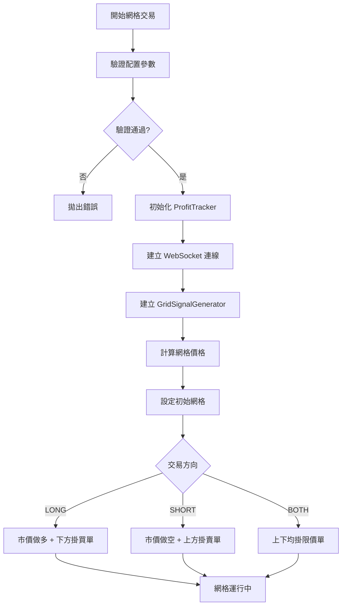
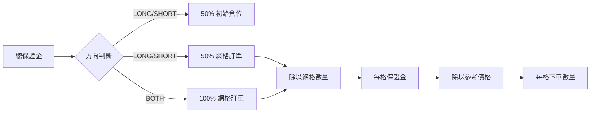
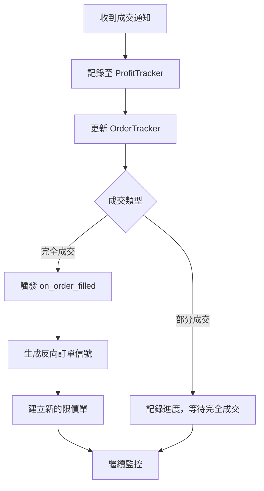
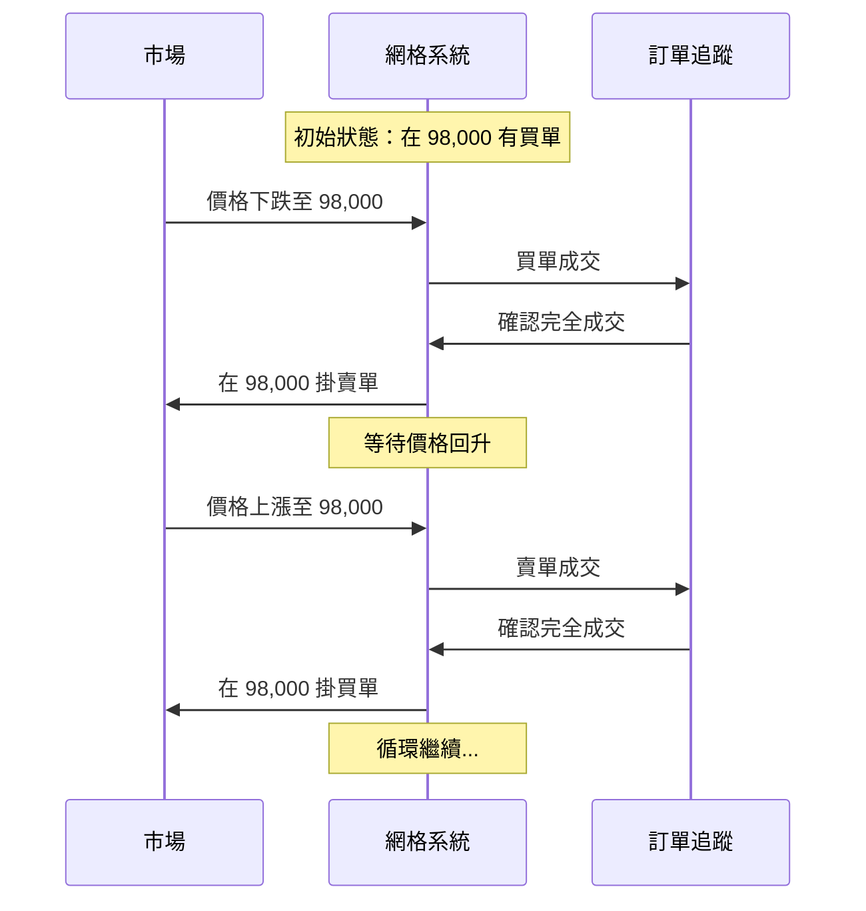
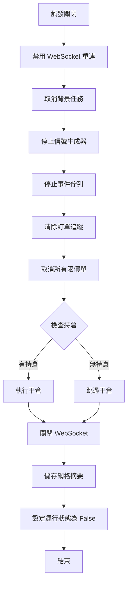
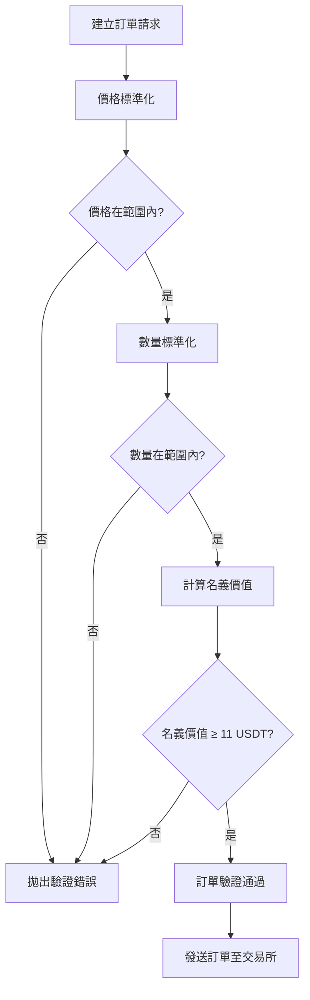

# 網格交易邏輯文件

本文件說明網格交易機器人的核心運作邏輯，包含網格開啟、運行、結束的完整流程，以及參數設定的限制規範。

---

## 目錄

1. [網格開啟細節](#1-網格開啟細節)
2. [網格運行細節](#2-網格運行細節)
3. [網格結束細節](#3-網格結束細節)
4. [參數設定限制](#4-參數設定限制)

---

## 1. 網格開啟細節

### 1.1 初始化流程



### 1.2 網格價格計算

系統支援兩種網格類型：**等差網格**與**等比網格**。

#### 等差網格 (ARITHMETIC)

價格以固定間距分佈：

```
grid_levels_above = grid_levels ÷ 2        （上方網格數）
grid_levels_below = grid_levels - grid_levels_above  （下方網格數）

上方格距 = (upper_bound - current_price) / grid_levels_above
下方格距 = (current_price - lower_bound) / grid_levels_below
```

**範例**：
- current_price = 100,000 USDT
- upper_bound = 110,000 USDT
- lower_bound = 90,000 USDT
- grid_levels = 10

計算結果：
- 上方網格：100,000 → 102,000 → 104,000 → 106,000 → 108,000 → 110,000
- 下方網格：100,000 → 98,000 → 96,000 → 94,000 → 92,000 → 90,000

#### 等比網格 (GEOMETRIC) (還沒有仔細研究開發，可先跳過)

價格以固定比例分佈：

```
下方網格: price[i] = current_price × (1 - grid_ratio)^i
上方網格: price[i] = current_price × (1 + grid_ratio)^i
```

其中 `i = 1, 2, 3, ...`，`grid_ratio` 建議設定在 0.01 ~ 0.1 之間。

**範例**（grid_ratio = 0.02）：
- current_price = 100,000 USDT
- 下方網格：98,000 → 96,040 → 94,119 → ...
- 上方網格：102,000 → 104,040 → 106,121 → ...

### 1.3 依方向的初始佈局

| 方向 | 初始倉位 | 網格訂單 | 保證金分配 |
|------|---------|---------|-----------|
| **LONG** | 市價做多（使用 50% 保證金） | 當前價格下方掛買單（使用 50% 保證金） | 50% / 50% |
| **SHORT** | 市價做空（使用 50% 保證金） | 當前價格上方掛賣單（使用 50% 保證金） | 50% / 50% |
| **BOTH** | 無初始倉位 | 當前價格上下均掛限價單（使用 100% 保證金） | 0% / 100% |

### 1.4 每格金額與數量計算

#### Orderly 交易所限制

| 限制項目 | 數值 | 說明 |
|---------|------|------|
| 每格最小名義價值 | **11 USDT** | 交易所要求每筆訂單的名義價值（價格 × 數量）必須 ≥ 11 USDT |
| 最小總保證金 | grid_levels × 11 USDT | 確保每格都能滿足最小名義價值要求 |

#### 保證金分配計算

**每格保證金 (margin_per_grid)**

```
LONG 方向:
  margin_per_grid = (total_margin × 50%) / 下方網格數量

SHORT 方向:
  margin_per_grid = (total_margin × 50%) / 上方網格數量

BOTH 方向:
  margin_per_grid = total_margin / grid_levels
```

#### 參考價格選擇（保守策略）

為確保所有網格訂單都有足夠資金執行，系統採用保守的參考價格計算數量：

| 方向 | 參考價格 | 原因 |
|------|---------|------|
| **LONG** | `min(下方網格價格)` | 使用最低價格，確保最差情況下也能買入 |
| **SHORT** | `max(上方網格價格)` | 使用最高價格，確保保守計算 |
| **BOTH** | `upper_bound` | 使用價格上界，最保守的參考 |

#### BASE_AMOUNT（每格下單數量）計算

```
quantity_per_grid = margin_per_grid / reference_price
```

**計算範例（LONG 方向）**：

| 參數 | 數值 |
|------|------|
| total_margin | 1,000 USDT |
| grid_levels | 10 格（上方 5 格、下方 5 格） |
| current_price | 100,000 USDT |
| lower_bound | 90,000 USDT |
| 最低網格價格 | 90,000 USDT |

計算步驟：
1. 網格保證金 = 1,000 × 50% = 500 USDT
2. 每格保證金 = 500 / 5 = 100 USDT
3. 每格數量 = 100 / 90,000 = **0.00111 BTC**

#### 預留空間機制

系統透過**保守參考價格策略**來實現預留空間：

1. **使用最低/最高價格計算數量**：確保在任何網格價位都能成功下單
2. **實際下單價格較高時**：相同數量所需的實際保證金較少
3. **自然形成的緩衝區**：高價位網格自動擁有額外的保證金餘裕



---

## 2. 網格運行細節

### 2.1 成交處理流程



### 2.2 反向訂單機制（Counter-Signal）

當一筆網格訂單**完全成交**後，系統會自動在**相同價格**建立一筆**反向訂單**，實現網格的持續運作。

#### 反向訂單規則

| 策略方向 | 買單成交後 | 賣單成交後 |
|---------|-----------|-----------|
| **LONG** | 在同價位掛賣單（獲利了結） | 在同價位掛買單（重新累積） |
| **SHORT** | 在同價位掛賣單（重新累積） | 在同價位掛買單（獲利了結） |
| **BOTH** | 在同價位掛賣單 | 在同價位掛買單 |

#### 運作示意



### 2.3 部分成交處理

- **部分成交不觸發反向訂單**：系統會等待訂單完全成交後才生成反向信號
- **進度追蹤**：系統會記錄部分成交的進度百分比
- **防重複處理**：透過 `processed_fills` 快取避免重複處理同一筆成交

### 2.4 訂單去重機制

系統實作多層次的去重機制防止重複下單：

1. **價格-方向匹配**：檢查是否已有相同價格和方向的訂單
2. **過期追蹤**：追蹤待處理訂單並設定 TTL
3. **網格索引**：維護 `price → order_id` 的映射關係

---

## 3. 網格結束細節

### 3.1 關閉流程



### 3.2 關閉步驟詳解

| 步驟 | 動作 | 說明 |
|------|------|------|
| 1 | 禁用 WebSocket 重連 | 設定 `ws_should_reconnect = False` |
| 2 | 取消背景任務 | 停止 WebSocket 重連任務、健康監控、訂單同步任務 |
| 3 | 停止信號生成器 | 呼叫 `signal_generator.stop_by_signal()` |
| 4 | 停止事件佇列 | 優雅關閉事件處理 |
| 5 | 清除訂單追蹤 | 清空 OrderTracker 和 processed_fills 快取 |
| 6 | 取消所有限價單 | 遍歷 grid_orders，每筆間隔 0.1 秒取消 |
| 7 | 平倉 | 若有未平倉位，執行 `client.close_position()` |
| 8 | 關閉 WebSocket | 安全關閉連線 |
| 9 | 儲存網格摘要 | 將最終統計資料寫入資料庫 |

### 3.3 停損機制

系統支援兩種停損價格設定：

| 停損類型 | 參數 | 觸發條件 | 說明 |
|---------|------|---------|------|
| **下方停損** | `stop_bot_price` | 市場價格 ≤ stop_bot_price | 價格跌破下限時觸發停損 |
| **上方停損** | `stop_top_price` | 市場價格 ≥ stop_top_price | 價格突破上限時觸發停損 |

停損觸發後，系統會執行完整的關閉流程，並在網格摘要中記錄停損原因。

### 3.4 關閉原因類型

| 原因 | 說明 |
|------|------|
| `MANUAL` | 使用者手動關閉 |
| `STOP_BOT_PRICE` | 下方停損觸發 |
| `STOP_TOP_PRICE` | 上方停損觸發 |

---

## 4. 參數設定限制

### 4.1 核心參數限制

| 參數 | 類型 | 最小值 | 最大值 | 說明 |
|------|------|-------|-------|------|
| `grid_levels` | int | 2 | 100 | 網格層數 |
| `total_margin` | float | grid_levels × 11 USDT | - | 總保證金（需滿足每格最小值）|
| `upper_bound` | float | > current_price | - | 價格上界 |
| `lower_bound` | float | > 0 | < current_price | 價格下界 |
| `grid_ratio` | float | > 0 | < 1 | 等比網格比例（建議 0.01-0.1）|
| `stop_bot_price` | float | - | < lower_bound | 下方停損價（選填）|
| `stop_top_price` | float | > upper_bound | - | 上方停損價（選填）|

### 4.2 價格關係驗證

系統會驗證以下價格關係：

```
stop_bot_price < lower_bound < current_price < upper_bound < stop_top_price
```

**額外驗證規則**：

| 規則 | 條件 | 錯誤訊息 |
|------|------|---------|
| 價格範圍最小值 | price_range ≥ current_price × 1% | "網格價格範圍太小，應至少為當前價格的1%" |
| 網格密度最小值 | grid_spacing ≥ current_price × 0.1% | "網格太密集，請減少網格層數或擴大價格範圍" |

### 4.3 市場特定限制

各交易對有不同的精度和數量限制：

| 交易對 | tick_size | step_size | min_notional | min_quantity | max_quantity |
|--------|-----------|-----------|--------------|--------------|--------------|
| PERP_BTC_USDC | 0.01 | 0.0001 | 11 USDT | 0.0001 | 1,000 |
| PERP_ETH_USDC | 0.01 | 0.001 | 11 USDT | 0.001 | 100 |
| PERP_SOL_USDC | 0.001 | 0.01 | 11 USDT | 0.01 | 10,000 |
| PERP_NEAR_USDC | 0.001 | 0.1 | 11 USDT | 0.1 | 100,000 |
| PERP_ARB_USDC | 0.0001 | 0.1 | 11 USDT | 0.1 | 100,000 |
| PERP_OP_USDC | 0.001 | 0.1 | 11 USDT | 0.1 | 100,000 |

**欄位說明**：
- `tick_size`：價格最小變動單位
- `step_size`：數量最小變動單位
- `min_notional`：最小名義價值（價格 × 數量）
- `min_quantity`：最小下單數量
- `max_quantity`：最大下單數量

### 4.4 訂單驗證流程



### 4.5 計算公式總結

| 計算項目 | 公式 |
|---------|------|
| 等差網格間距 | `(upper_bound - lower_bound) / (grid_levels - 1)` |
| 等比網格價格 | `current_price × (1 ± grid_ratio)^i` |
| 每格保證金 | `total_margin / grid_levels` 或 `(total_margin × 50%) / 單邊網格數` |
| 每格數量 | `margin_per_grid / reference_price` |
| 初始倉位大小 | `initial_margin / current_price` |
| 名義價值 | `price × quantity` |

---

## 附錄：常數設定

| 常數 | 值 | 說明 |
|------|-----|------|
| `ORDER_CREATION_DELAY` | 0.1 秒 | 訂單建立間隔，避免 Rate Limit |
| `PROCESSED_FILLS_MAX_SIZE` | 1,000 | 成交記錄快取大小 |
| `PROCESSED_FILLS_TTL` | 300 秒 | 成交記錄快取存活時間 |
| `WS_RECONNECT_MAX_RETRIES` | 8 次 | WebSocket 最大重連次數 |
| `WS_RECONNECT_BASE_DELAY` | 3 秒 | WebSocket 重連基礎延遲 |
| `WS_RECONNECT_MAX_DELAY` | 120 秒 | WebSocket 最大重連延遲 |

---

*文件最後更新：2025-12-08*

